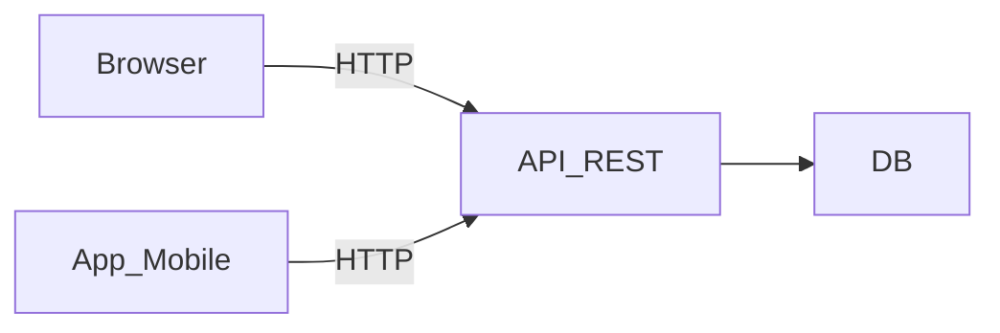

### 🏫 **Institución:** IES 9-018 "Gobernador Celso Jaque"
### 📚 **Carrera:** Tecnicatura Superior en Desarrollo de Software
### 📖 **Materia:** Arquitectura y Diseño de Interfaces
### 👨‍🏫 **Profesor:** Paulo Alvarez
### 📅 **Año:** 2026 | **Curso:** 3° AÑO

---

# Arquitectura Web vs. Mobile

## ¿Son lo mismo?

No, aunque compartan backend. Un sistema web y una app mobile tienen **necesidades arquitectónicas distintas**.



En la superficie comparten API, pero por debajo cada frontend plantea desafíos distintos.

---

## Arquitectura Web

### Cómo funciona

```
[Browser] ──HTTPS──→ [Servidor Web] ──→ [API/Backend] ──→ [Base de Datos]
```

### Stack típico

| Capa | Tecnologías 2026 |
|:-----|:-----------------|
| Frontend | HTML + CSS + JavaScript (React, Vue, Svelte, Next.js) |
| Backend | Node.js, Python (FastAPI, Django), Java (Spring), C# (.NET) |
| Base de Datos | PostgreSQL, MySQL, SQLite |
| Infraestructura | Docker, Nginx, VPS o Cloud (Render, Railway) |

### Características clave

| Aspecto | Web |
|:--------|:----|
| Acceso | Desde cualquier navegador, sin instalar |
| Actualización | Instantánea (el usuario siempre ve la última versión) |
| Offline | Muy limitado (con Service Worker se puede parcial) |
| Sensor hardware | Muy limitado (geolocalización sí, cámara con permiso, pero no NFC, bluetooth, etc.) |
| Performance | Limitada por el navegador |
| Distribución | Solo un link, no pasa por tiendas |

---

## Arquitectura Mobile

### Tipos de apps

| Tipo | ¿Qué es? | Ejemplos |
|:-----|:---------|:---------|
| **Nativa** | Código específico para el sistema operativo (Swift/Kotlin) | Maps, Spotify, Instagram |
| **Híbrida** | WebView con empaquetado nativo (Ionic, Capacitor) | Muchas apps empresariales |
| **Cross-platform** | Un solo código que compila a nativo (Flutter, React Native) | Google Ads (Flutter), Facebook (React Native) |

### Características clave

| Aspecto | Mobile |
|:--------|:-------|
| Acceso | Descarga desde app store, instalación |
| Actualización | El usuario debe descargar la actualización |
| Offline | Puede funcionar sin internet (datos locales) |
| Sensor hardware | Cámara, GPS, NFC, Bluetooth, acelarómetro, giróscopo |
| Performance | Cercana al hardware, experiências fluidas |
| Distribución | App Store / Google Play (aprobación necesaria) |

---

## ¿Cuándo elegir cada una?

| Si el proyecto es... | Mejor opción |
|:---------------------|:-------------|
| Un sistema interno para la escuela | **Web** (no requiere instalación, acceden desde cualquier PC) |
| Una app para crianceros que trabajan sin señal | **Mobile híbrida o nativa** (necesita funcionar offline) |
| Una landing page o web institucional | **Web** (showcase, contenido público) |
| Un sistema con formularios y flujos de aprobación | **Web** (mejor para escribir, ver tablas, flujos complejos) |
| Una app que necesita la cámara o el GPS del celular | **Mobile** (acceso directo al hardware) |

---

## Mono-repositorio (Monorepo)

Para proyectos que tienen web + mobile, conviene el **monorepo**: todo el código en un solo repo.

```
proyecto/
├── frontend/          # Web (React, Next.js, etc.)
├── mobile/            # App (Flutter, React Native, etc.)
├── backend/           # API compartida
├── docs/              # Documentación
├── docker-compose.yml # Infraestructura compartida
└── README.md
```

**Ventaja:** Un solo `git clone`, un solo PR para cambios que tocan web + backend. Los agentes IA trabajan en el mismo contexto.

---

## Nuestro Stack Recomendado

Para los proyectos de la materia, esta combinación es la que mejor relación **aprendizaje / complejidad** ofrece:

| Capa | Tecnología | ¿Por qué? |
|:-----|:-----------|:-----------|
| Frontend Web | React + Vite o Next.js | El ecosistema más grande, documentación infinita |
| Mobile (si aplica) | Next.js responsive primero, Flutter si se necesita nativo | Partir de web, agregar mobile si hace falta |
| Backend | Python + FastAPI | Sencillo, educativo, excelente documentación |
| Base de Datos | SQLite (desarrollo) / PostgreSQL (producción) | SQLite no necesita instalación, PostgreSQL es estándar |
| Contenedores | Docker | Un solo comando para levantar todo |

---

## Para Recordar

> No elijas tecnología por moda. Elegí por el problema que resolvés.
> Una web bien hecha sirve para el 80% de los proyectos educativos.
> Mobile solo cuando el usuario **necesita** estar afuera, sin escritorio ni señal.

**Próximo paso:** Leé `05-estandares-globales.md` para conocer las convenciones que usan los desarrolladores profesionales en todo el mundo.
