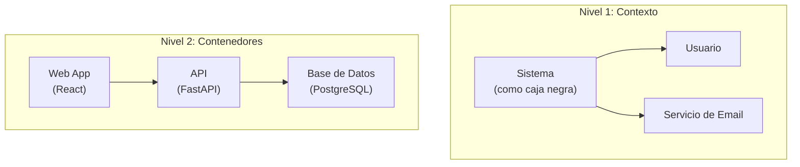
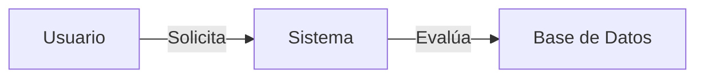

### 🏫 **Institución:** IES 9-018 "Gobernador Celso Jaque"
### 📚 **Carrera:** Tecnicatura Superior en Desarrollo de Software
### 📖 **Materia:** Arquitectura y Diseño de Interfaces
### 👨‍🏫 **Profesor:** Paulo Alvarez
### 📅 **Año:** 2026 | **Curso:** 3° AÑO

---

# Estándares Globales en Desarrollo de Software

## ¿Por qué existen los estándares?

Imaginá que cada país usara un tipo de enchufe distinto sin avisar. Viajás a otro país, querés cargar el celular y no podés.

En software pasa lo mismo: cada equipo podría nombrar commits a su manera, versionar como se le ocurra, documentar donde quiera. El resultado es **caos**.

Los estándares existen para que **todos hablemos el mismo idioma**. No son burocracia. Son **acuerdos que nos facilitan la vida**.

---

## Conventional Commits

El estándar más importante para escribir mensajes de commit.

**Formato:** `<tipo>: <descripción breve>`

| Tipo | Cuándo usarlo |
|:-----|:--------------|
| `feat:` | Nueva funcionalidad |
| `fix:` | Corrección de error |
| `docs:` | Documentación |
| `refactor:` | Mejora de código sin cambiar funcionalidad |
| `test:` | Agregar o modificar tests |
| `chore:` | Mantenimiento (config, builds, dependencias) |
| `style:` | Formato (espacios, comas) sin cambiar lógica |

```bash
# ✅ Bien
git commit -m "feat: agrega endpoint POST /usuarios con validación JWT"
git commit -m "fix: corrige error 500 cuando el email está vacío"

# ❌ Mal
git commit -m "cambios"        # No dice qué cambió
git commit -m "asdf"           # Inentendible
git commit -m "varios fixes"   # Un commit debe hacer UNA cosa
```

**Referencia:** [conventionalcommits.org](https://www.conventionalcommits.org)

---

## SemVer (Semantic Versioning)

Estándar para numerar versiones de software.

```
MAJOR.MINOR.PATCH
  1   .  2   .  3
```

| Parte | ¿Cuándo aumenta? |
|:------|:-----------------|
| **MAJOR** (1.x.x) | Cambios que rompen compatibilidad con versiones anteriores |
| **MINOR** (x.2.x) | Funcionalidad nueva sin romper nada existente |
| **PATCH** (x.x.3) | Corrección de bugs, sin cambios funcionales |

**Analogía:** Las ediciones de un libro. 1° edición → 2° edición (MAJOR, cambió contenido). Reimpresión con erratas corregidas (PATCH). Edición ampliada con nuevo capítulo (MINOR).

**Referencia:** [semver.org](https://semver.org)

---

## C4 Model

Estándar para diagramar la arquitectura de software en 4 niveles.



| Nivel | ¿Qué muestra? | ¿Para quién? |
|:------|:--------------|:-------------|
| 1 - Contexto | El sistema y con quién se relaciona | Directivos, stakeholders no técnicos |
| 2 - Contenedores | Las aplicaciones y bases de datos que lo componen | Desarrolladores, DevOps |
| 3 - Componentes | Los módulos internos de cada contenedor | Arquitectos, desarrolladores |
| 4 - Código | Las clases o funciones principales (opcional) | Desarrolladores |

**Analogía de Google Maps:** Nivel 1 es el mapa del país. Nivel 2 es el mapa de la ciudad. Nivel 3 es el mapa del barrio. Nivel 4 es Street View de una cuadra.

**Referencia:** [c4model.com](https://c4model.com)

---

## ADR (Architecture Decision Record)

Documento corto que registra **por qué** se tomó una decisión arquitectónica.

### Estructura estándar

```markdown
# ADR-001: Elección de base de datos

## Contexto
Necesitamos persistir los datos del sistema de solicitudes.
El equipo conoce SQL pero no tiene experiencia con bases de datos
no relacionales. La aplicación maneja datos estructurados (usuarios,
solicitudes, resoluciones).

## Decisión
Usaremos PostgreSQL como base de datos principal.

## Opciones consideradas
- SQLite: no soporta concurrencia, la descartamos
- MySQL: buena opción pero PostgreSQL tiene mejor soporte
  de tipos de datos avanzados (JSON, arrays)
- MongoDB: no justificado para datos relacionales

## Consecuencias
- Positivas: SQL estándar, migraciones versionadas, buena comunidad
- Negativas: requiere servidor aparte (no es embedded como SQLite)
- Riesgo: nadie del equipo administró PostgreSQL antes,
  mitigado con Docker compose
```

**Analogía:** Es el acta de una reunión de directorio. No solo dice "se decidió comprar el edificio", sino que explica por qué ESE y no otro, qué alternativas se evaluaron y qué implica.

**Referencia:** [adr.github.io](https://adr.github.io)

---

## OWASP Top 10

Las 10 vulnerabilidades más críticas en aplicaciones web.

| # | Vulnerabilidad | Ejemplo |
|:-:|:---------------|:--------|
| 1 | Broken Access Control | Un usuario normal accede al panel de admin cambiando la URL |
| 2 | Cryptographic Failures | Guardar contraseñas en texto plano |
| 3 | Injection | SQL Injection: `' OR 1=1 --` |
| 4 | Insecure Design | No validar datos de entrada del usuario |
| 5 | Security Misconfiguration | Debug mode activado en producción |
| 6 | Vulnerable Components | Usar una librería con vulnerabilidad conocida |
| 7 | Auth Failures | Permitir contraseñas débiles |
| 8 | Data Integrity Failures | No firmar JWTs |
| 9 | Logging Failures | No registrar intentos de acceso fallidos |
| 10 | SSRF | El servidor hace peticiones a sitios internos sin control |

**Referencia:** [owasp.org/Top10](https://owasp.org/www-project-top-ten/)

---

## 12 Factor App

Metodología para construir aplicaciones que se despliegan en la nube.

| Factor | Principio |
|:-------|:----------|
| 1 | **Código base**: un repo, múltiples despliegues |
| 2 | **Dependencias**: declaradas explícitamente |
| 3 | **Configuración**: en variables de entorno, no en el código |
| 4 | **Backing services**: tratados como recursos conectables |
| 5 | **Build, release, run**: etapas separadas |
| 6 | **Processes**: stateless, sin estado local |
| 7 | **Port binding**: auto-contenido, expone un puerto |
| 8 | **Concurrency**: escalar con procesos, no hilos |
| 9 | **Disposability**: arranque y apagado rápido |
| 10 | **Dev/Prod parity**: entornos lo más parecidos posible |
| 11 | **Logs**: como flujo de eventos |
| 12 | **Admin processes**: tareas de administración como procesos únicos |

**Referencia:** [12factor.net](https://12factor.net/es/)

---

## Keep a Changelog

Estándar para mantener un registro de cambios del proyecto.

```markdown
# Changelog

## [1.1.0] — 2026-06-01
### Added
- Nuevo endpoint de búsqueda

### Fixed
- Error al cargar imágenes grandes

## [1.0.0] — 2026-05-15
### Added
- Primer release del sistema
```

**Referencia:** [keepachangelog.com](https://keepachangelog.com/es/1.0.0/)

---

## Mermaid

Lenguaje de texto para generar diagramas que se renderizan en GitHub, VS Code y documentación.



Se escribe como Markdown común y GitHub lo convierte automáticamente en imagen. No necesitas herramientas externas de diagramado.

**Referencia:** [mermaid.js.org](https://mermaid.js.org)

---

## ¿Cómo aplican los agentes IA estos estándares?

En nuestro andamiaje:

| Agente | Estándar que aplica |
|:-------|:--------------------|
| **Arquitecto** | C4 Model (diagramas), ADRs (decisiones) |
| **Modelador** | DDD (Domain-Driven Design), normalización de datos |
| **Implementador** | Conventional Commits, código siguiendo patrones |
| **Verificador** | Tests según estándares, chequea calidad |
| **Repositorio** | SemVer, Changelog, CI/CD |

> El estándar no es opcional. En esta materia, commits sin Conventional Commits o ADRs sin formato no se aprueban.

**Guía de referencia rápida:** [docs.github.com/es](https://docs.github.com/es)
