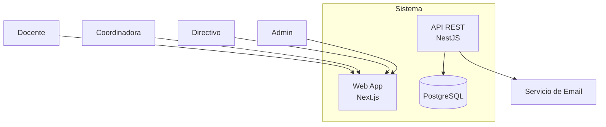

# Ejemplo Real: Output del Agente Arquitecto

Este documento muestra cómo documenta un agente IA en un proyecto real.
Fuente: [Plataforma San José](https://github.com/edusanjose/plataforma-san-jose) — sistema de informes pedagógicos.

---

## 1. AGENTS.md (Archivo de Sesión)

El agente lee este archivo al iniciar para entender el contexto completo del proyecto.

```markdown
# Proyecto — Sesión de Arquitectura

## Usuario: Paulo
Director del proyecto. Conoce el colegio, no la jerga técnica.

## Proyecto
Plataforma educativa institucional. Gestión de informes pedagógicos,
gestión documental docente y portal de familias.

## Stack decidido
Frontend: Next.js 14 + TailwindCSS
Backend: NestJS + Prisma + PostgreSQL 16
Infra: Docker + Nginx + Cloudflare Tunnel

## Agentes disponibles (6)
| Agente | Rol |
|--------|-----|
| @arquitecto | Guardián del dominio, solo lectura |
| @modelador | Prisma schema + tipos + validaciones |
| @implementador | Backend + Frontend |
| @verificador | Tests + lint + typecheck |
| @repositorio | Versionado + CI/CD + releases |

## Reglas
- Nunca generar código sin autorización
- Hablar en lenguaje del dominio, no técnico
- Toda decisión se documenta en `docs/`
- Seguir el flujo de 5 agentes para cada módulo
```

---

## 2. ADR (Architecture Decision Record)

Decisión arquitectónica documentada por el agente. Cada ADR es un archivo separado en `docs/adr/`.

````markdown
# ADR-011: Workflow de Informes Pedagógicos

## Contexto
Los informes pedagógicos pasan por varias etapas:
Docente escribe → Coordinadora revisa → Directivo aprueba → Publicación.
Cada actor necesita saber en qué estado está cada informe y qué acción puede tomar.

## Decisión
Workflow de 4 estados con transiciones explícitas:

```
BORRADOR → ENVIADO → REVISION → APROBADO → PUBLICADO
    ↑                        ↓          ↑
    └── Docente corrige ─────┘          │
    └── Coordinadora devuelve ──────────┘
```

1. **BORRADOR**: el docente escribe, solo él lo ve
2. **ENVIADO**: docente termina, lo envía a coordinadora
3. **REVISION**: coordinadora lo revisa, puede:
   - Aprobarlo → pasa a APROBADO
   - Devolverlo al docente → vuelve a BORRADOR
4. **APROBADO**: directivo lo ve, puede publicarlo
5. **PUBLICADO**: visible para familias, se genera PDF

## Opciones consideradas
- Workflow lineal simple (sin devolución): no permite corrección → descartado
- Estados con permisos RBAC detallados: asegura que cada actor haga solo lo suyo

## Consecuencias
- Positivas: trazabilidad completa, cada cambio registrado
- Negativas: más endpoints, más tests, más lógica de estados
- El historial de cambios se guarda en tabla `InformeHistorial`
````

---

## 3. Diagrama C4 (Contexto)

El agente genera diagramas en Mermaid que se renderizan solos en GitHub:



---

## 4. Modelo de Datos (Output del Agente Modelador)

````markdown
# Modelo Conceptual — Módulo de Informes

## Entidades principales

### Informe
- id: UUID
- alumnoId: UUID (FK → Alumno)
- periodoId: UUID (FK → Periodo)
- estado: ENUM(BORRADOR, ENVIADO, REVISION, APROBADO, PUBLICADO)
- creadoEn: DateTime
- actualizadoEn: DateTime

### InformeMateria
- id: UUID
- informeId: UUID (FK → Informe)
- materiaId: UUID (FK → Materia)
- docenteId: UUID (FK → Persona)
- estado: ENUM(BORRADOR, ENVIADO, REVISION, APROBADO)
- observaciones: JSON

### Observacion
- id: UUID
- informeMateriaId: UUID (FK → InformeMateria)
- campoId: UUID (FK → CampoPlantilla)
- valor: Text
````

---

## 5. Wireframe (Output del Agente Diseñador UI)

```
+--------------------------------------------------+
| [Logo] Plataforma San José    [Docente] [Salir]   |
+--------------------------------------------------+
|                                                    |
|   📋 MIS MATERIAS A CARGO                         |
|                                                    |
|   +-------------------+-----------------------+    |
|   | Materia           | Progreso Informes     |    |
|   +-------------------+-----------------------+    |
|   | Matemática 3° A   | ✅ 20/20 completados |    |
|   | Lengua 3° A       | ⚠️ 15/20 completados |    |
|   | Ciencias 3° A     | ❌ 0/20 completados  |    |
|   +-------------------+-----------------------+    |
|                                                    |
|   [✏️ Cargar observaciones]                        |
+--------------------------------------------------+
```

---

## Lo que el Estudiante Debe Hacer con Esto

| El agente genera... | Vos tenés que... |
|:--------------------|:-----------------|
| ADR con decisión | Leerlo, entenderlo, aprobarlo o pedir cambios |
| Diagrama C4 | Verificar que refleje el sistema real |
| Modelo de datos | Validar que las entidades y relaciones son correctas |
| Wireframe | Decidir si el diseño es claro y usable |
| Código | Revisarlo, probarlo, reportar bugs |

> **No importa que el agente lo genere. Importa que vos lo entiendas y puedas explicarlo.**
