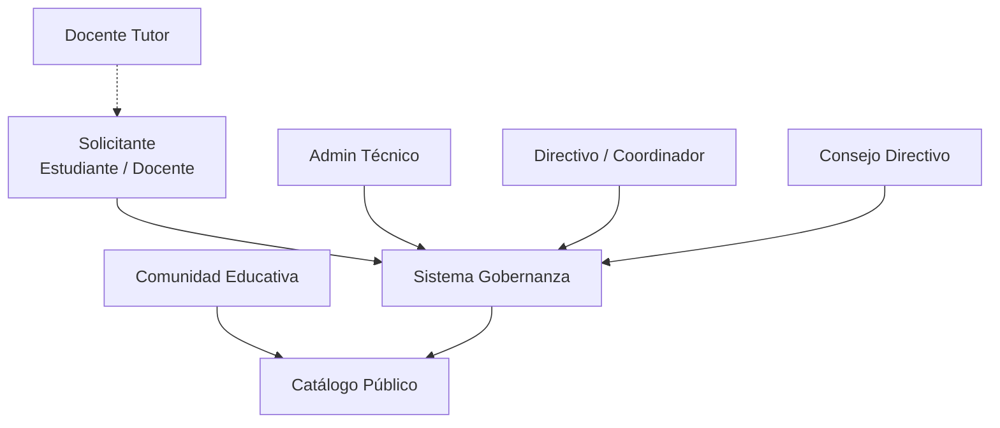

# Stakeholders — Gobernanza Digital

> **Agente:** Analista | **Fuente:** [IES9018/gobernanza-servicios-digitales](https://github.com/IES9018/gobernanza-servicios-digitales)

---

## Mapa de stakeholders

---

## Perfiles detallados

### 1. Solicitante (Estudiante o Docente)

| Atributo | Descripción |
|:---------|:------------|
| **Rol** | Persona que solicita alojar un servicio digital en el servidor escolar |
| **Necesidad** | Completar y enviar una solicitud de alojamiento, hacer seguimiento del estado |
| **Frecuencia de uso** | Ocasional (1-2 veces por proyecto, típicamente al inicio del cuatrimestre) |
| **Nivel técnico** | Variable (estudiantes de 1er a 3er año, docentes de distintas áreas) |
| **Preocupaciones** | Que el proceso sea claro, que no se pierda la solicitud, saber en qué estado está |
| **Fuente** | [Doc 01](https://github.com/IES9018/gobernanza-servicios-digitales/blob/main/docs/01_SOLICITUD_ALOJAMIENTO.md), [Doc 07](https://github.com/IES9018/gobernanza-servicios-digitales/blob/main/docs/07_SOLICITUD_USUARIO.md) |

---

### 2. Admin Técnico

| Atributo | Descripción |
|:---------|:------------|
| **Rol** | Persona responsable de la infraestructura del servidor escolar |
| **Necesidad** | Evaluar técnicamente cada solicitud, verificar seguridad, asignar recursos |
| **Frecuencia de uso** | Semanal (cada solicitud nueva requiere evaluación) |
| **Nivel técnico** | Alto (conoce Docker, redes, seguridad, DNS) |
| **Preocupaciones** | Que las apps no comprometan la seguridad del servidor, que los recursos estén bien asignados, que los subdominios no colisionen |
| **Acceso** | Única persona con acceso a DNS y asignación de subdominios |
| **Fuente** | [Doc 02](https://github.com/IES9018/gobernanza-servicios-digitales/blob/main/docs/02_EVALUACION_TECNICA.md), [Doc 00 §3] |

---

### 3. Directivo / Coordinador

| Atributo | Descripción |
|:---------|:------------|
| **Rol** | Director, coordinador de carrera o miembro de dirección |
| **Necesidad** | Evaluar institucionalmente las solicitudes, verificar alineación educativa |
| **Frecuencia de uso** | Ocasional (cuando una solicitud supera la evaluación técnica) |
| **Nivel técnico** | Bajo-Medio (no necesita saber programar, pero sí entender el propósito educativo) |
| **Preocupaciones** | Que el proyecto esté alineado con el perfil profesional, que no represente riesgo institucional |
| **Fuente** | [Doc 03](https://github.com/IES9018/gobernanza-servicios-digitales/blob/main/docs/03_EVALUACION_INSTITUCIONAL.md) |

---

### 4. Consejo Directivo

| Atributo | Descripción |
|:---------|:------------|
| **Rol** | Órgano colegiado que aprueba o rechaza formalmente las solicitudes |
| **Necesidad** | Emitir resoluciones formales, tener visibilidad de todas las solicitudes |
| **Frecuencia de uso** | Mensual (se reúne periódicamente) |
| **Nivel técnico** | Variable (miembros de distintos perfiles) |
| **Preocupaciones** | Que las decisiones queden documentadas, trazabilidad, transparencia |
| **Fuente** | [Doc 08](https://github.com/IES9018/gobernanza-servicios-digitales/blob/main/docs/08_RESOLUCION_DIRECTIVA.md) |

---

### 5. Docente Tutor

| Atributo | Descripción |
|:---------|:------------|
| **Rol** | Docente que supervisa el proyecto del estudiante |
| **Necesidad** | Avalar que el proyecto cumple objetivos pedagógicos |
| **Frecuencia de uso** | Por proyecto (al inicio, cuando el estudiante prepara la solicitud) |
| **Nivel técnico** | Alto (docentes de la tecnicatura) |
| **Preocupaciones** | Que el proyecto sea adecuado al nivel del estudiante, que la arquitectura esté bien justificada |

---

### 6. Comunidad Educativa (Público)

| Atributo | Descripción |
|:---------|:------------|
| **Rol** | Estudiantes, docentes, personal y público general |
| **Necesidad** | Ver el catálogo de servicios activos, auditar la transparencia del proceso |
| **Frecuencia de uso** | Ocasional (consulta) |
| **Nivel técnico** | Cualquiera (acceso público sin autenticación) |
| **Preocupaciones** | Saber qué servicios están funcionando, quién los mantiene, transparencia institucional |
| **Fuente** | [Doc 12](https://github.com/IES9018/gobernanza-servicios-digitales/blob/main/docs/12_TRANSPARENCIA_COMUNITARIA.md) |

---

## 🧠 Analogía del @docente

> Los stakeholders son como los **vecinos de un edificio**. El solicitante es el que quiere hacer una reforma en su departamento. El admin técnico es el encargado del edificio que revisa que la reforma no rompa caños ni paredes estructurales. El directivo es el consorcio que dice "esta reforma, ¿suma o resta al edificio?". El Consejo Directivo es la asamblea de propietarios que vota. Y la comunidad educativa son los vecinos del barrio que tienen derecho a saber qué se está construyendo. Todos tienen intereses distintos, y el sistema tiene que darle a cada uno exactamente lo que necesita, ni más ni menos.
