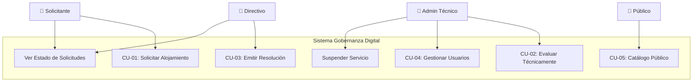

# Diagrama de Casos de Uso — Gobernanza Digital

| CU | Actor | Complejidad |
|:---|:------|:-----------:|
| CU-01 | Solicitante | Media |
| CU-02 | Admin Técnico | Media |
| CU-03 | Directivo | Baja |
| CU-04 | Admin Técnico | Baja |
| CU-05 | Público | Baja |
| CU-06 | Solicitante, Directivo | Baja |
| CU-07 | Admin Técnico | Baja |
