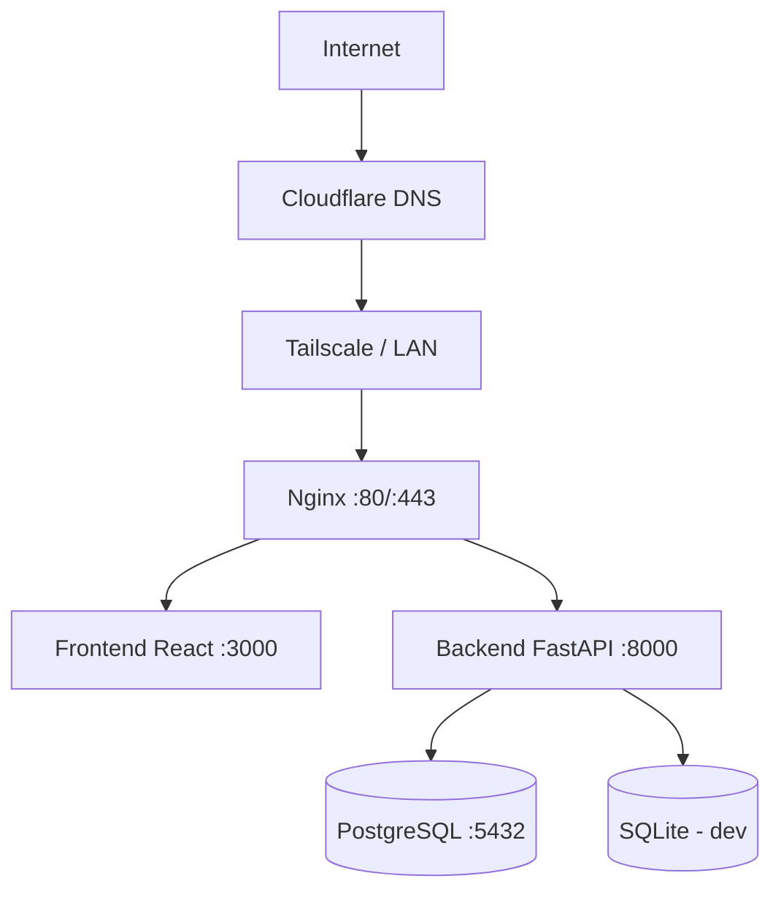

# ADR-005: Despliegue con Docker + Nginx en Debian 12

**Estado:** Aceptado | **Fecha:** Junio 2026 | **Autor:** Agente Arquitecto

---

## Contexto

El sistema debe desplegarse en el servidor escolar: Debian 12, Docker, Cloudflare, Tailscale, AdGuard Home, Nginx. Los estudiantes de Laboratorio de Servidores necesitan entender cómo se deploya una aplicación real en un entorno real.

---

## Decisión

Usar **Docker Compose con 3 servicios** desplegados detrás de **Nginx como reverse proxy**.

### Arquitectura de despliegue

### Servicios Docker

| Servicio | Puerto interno | Expuesto |
|:---------|:---------------|:---------|
| nginx | 80, 443 | Sí (externo) |
| frontend | 3000 | No (127.0.0.1) |
| backend | 8000 | No (127.0.0.1) |
| postgres | 5432 | No (red interna Docker) |

### Dominio

`gobernanzadigital.ies9018malargue.edu.ar`

Solo el admin técnico configura DNS/Cloudflare. Nadie más.

---

## Alternativas consideradas

| Alternativa | ¿Por qué no? |
|:------------|:-------------|
| Deploy directo sin Docker | "En mi máquina funciona." Docker garantiza que el entorno de desarrollo y producción sean idénticos. |
| Kubernetes | Excesivo para este proyecto. Docker Compose es suficiente para una app monolítica de esta escala. |
| Vercel / Railway / Render | El servidor es interno del IES. No se pueden usar servicios cloud externos por política institucional. |
| Apache en vez de Nginx | El servidor ya tiene Nginx. Además, Nginx es más eficiente como reverse proxy. |

---

## Consecuencias

**Positivas:**
- El mismo `docker-compose.yml` funciona en desarrollo y producción.
- CI/CD con GitHub Actions: build de imágenes, tests, deploy automático.
- Los estudiantes pueden clonar y ejecutar con `docker compose up`.
- Nginx maneja HTTPS (Let's Encrypt), rate limiting, y sirve estáticos.

**Negativas:**
- Docker agrega una capa de complejidad. El estudiante que nunca usó Docker necesita aprenderlo.
- Las imágenes de Docker ocupan espacio en disco del servidor escolar.
- CI/CD requiere GitHub Actions + secrets (Docker Hub o GitHub Container Registry).

---

## 🧠 Analogía del @docente

> Docker es como un **container de barco**. Adentro va tu aplicación exactamente como la preparaste: con sus dependencias, su versión de Python, sus librerías. Cerrás el container, lo subís al barco (servidor) y cuando llega a destino, lo abrís y funciona exactamente igual. No importa si el puerto de origen tiene Windows y el de destino Linux: el container es un mundo aparte. Nginx es el **capitán del puerto**: recibe todos los barcos, mira las etiquetas (dominios), y deriva cada uno al muelle que corresponde.
