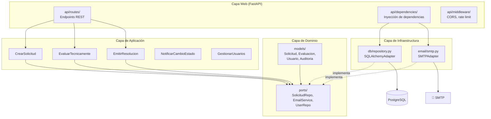

# Diagrama C4 — Nivel 3: Componentes (Backend)

> Vista interna del backend: capas hexagonales y sus componentes.

**Componentes:**
| Capa | Componente | Responsabilidad |
|:-----|:-----------|:----------------|
| Web | `api/routes/` | Endpoints REST: `/solicitudes`, `/auth`, `/catalogo` |
| Web | `api/dependencies/` | `get_db()`, `get_current_user()`, `get_role()` |
| Web | `api/middleware/` | CORS, rate limiting, logging |
| Aplicación | Casos de uso | Orquestan el dominio: validan, llaman repos, emiten eventos |
| Dominio | `models/` | Entidades puras sin dependencias externas |
| Dominio | `ports/` | Interfaces: `SolicitudRepository`, `EmailService` |
| Infraestructura | `db/` | Implementación concreta con SQLAlchemy |
| Infraestructura | `email/` | Adaptador SMTP con soporte para modo consola en dev |
