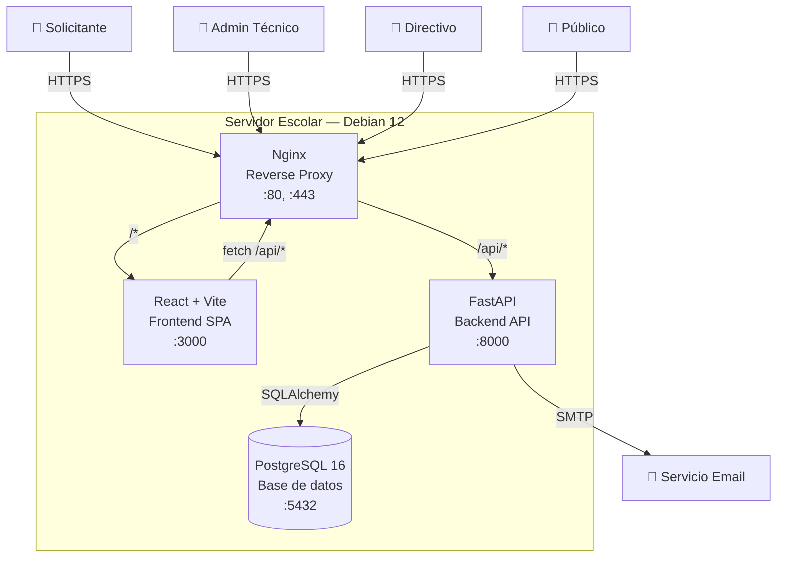

# Diagrama C4 — Nivel 2: Contenedores

> Vista de despliegue: cómo se distribuye el sistema en contenedores.

**Contenedores:**
| Contenedor | Tecnología | Responsabilidad |
|:-----------|:-----------|:----------------|
| Nginx | nginx:alpine | Reverse proxy, HTTPS, rate limiting, servir estáticos |
| Frontend | React 19 + Vite | Interfaz de usuario, formularios, paneles |
| Backend | Python 3.12 + FastAPI | API REST, lógica de negocio, autenticación JWT |
| PostgreSQL | postgres:16 | Persistencia de datos, backups |
