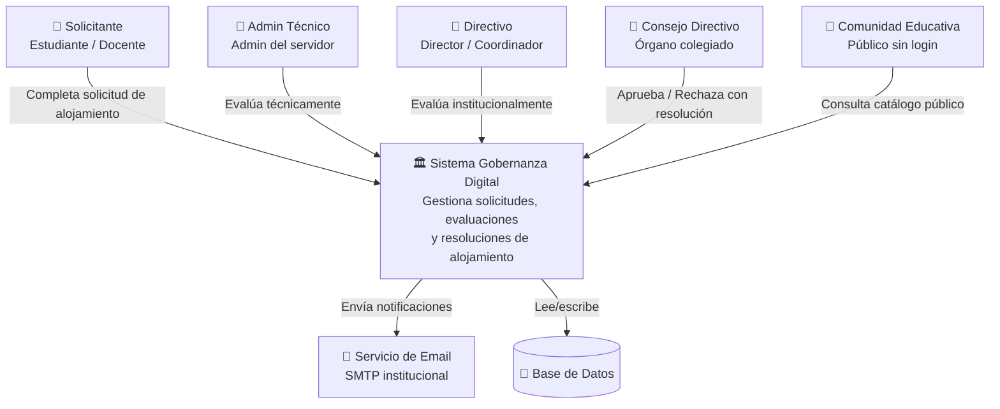

# Diagrama C4 — Nivel 1: Contexto

> Vista macro del sistema y sus relaciones con actores externos.

**Alcance:** El sistema Gobernanza Digital abarca el flujo completo desde la solicitud hasta la resolución, incluyendo evaluaciones, notificaciones y catálogo público. Los actores externos son roles humanos (solicitante, admin técnico, directivo, consejo, comunidad) y un servicio de email institucional.
