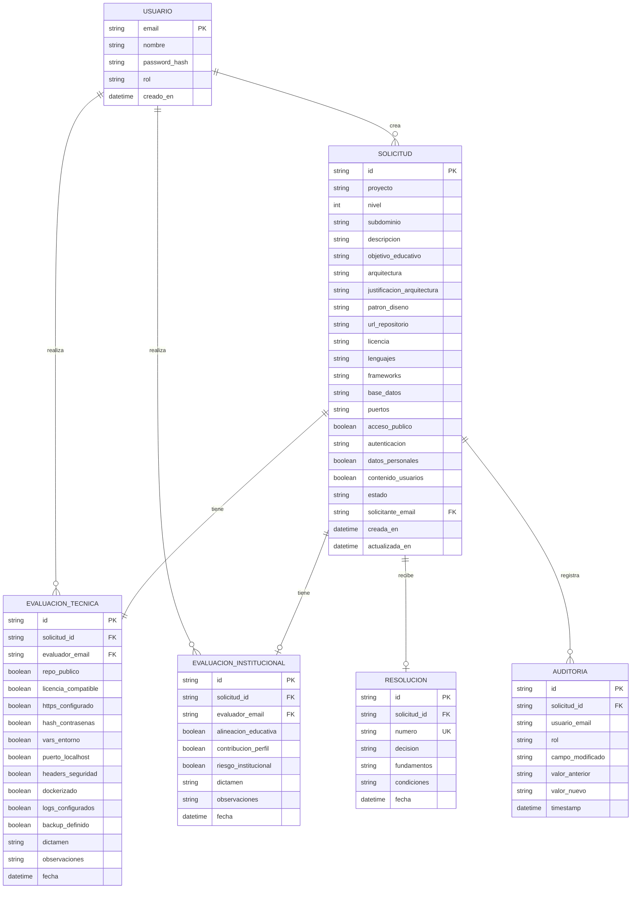

# Diagrama Entidad-Relación — Gobernanza Digital

```mermaid
erDiagram
    USUARIO {
        string email PK
        string nombre
        string password_hash
        string rol
        datetime creado_en
    }

    SOLICITUD {
        string id PK
        string proyecto
        int nivel
        string subdominio
        string descripcion
        string objetivo_educativo
        string arquitectura
        string justificacion_arquitectura
        string patron_diseno
        string url_repositorio
        string licencia
        string lenguajes
        string frameworks
        string base_datos
        string puertos
        boolean acceso_publico
        string autenticacion
        boolean datos_personales
        boolean contenido_usuarios
        string estado
        string solicitante_email FK
        datetime creada_en
        datetime actualizada_en
    }

    EVALUACION_TECNICA {
        string id PK
        string solicitud_id FK
        string evaluador_email FK
        boolean repo_publico
        boolean licencia_compatible
        boolean https_configurado
        boolean hash_contrasenas
        boolean vars_entorno
        boolean puerto_localhost
        boolean headers_seguridad
        boolean dockerizado
        boolean logs_configurados
        boolean backup_definido
        string dictamen
        string observaciones
        datetime fecha
    }

    EVALUACION_INSTITUCIONAL {
        string id PK
        string solicitud_id FK
        string evaluador_email FK
        boolean alineacion_educativa
        boolean contribucion_perfil
        boolean riesgo_institucional
        string dictamen
        string observaciones
        datetime fecha
    }

    RESOLUCION {
        string id PK
        string solicitud_id FK
        string numero UK
        string decision
        string fundamentos
        string condiciones
        datetime fecha
    }

    AUDITORIA {
        string id PK
        string solicitud_id FK
        string usuario_email
        string rol
        string campo_modificado
        string valor_anterior
        string valor_nuevo
        datetime timestamp
    }

    USUARIO ||--o{ SOLICITUD : "crea"
    USUARIO ||--o{ EVALUACION_TECNICA : "realiza"
    USUARIO ||--o{ EVALUACION_INSTITUCIONAL : "realiza"
    SOLICITUD ||--|| EVALUACION_TECNICA : "tiene"
    SOLICITUD ||--o| EVALUACION_INSTITUCIONAL : "tiene"
    SOLICITUD ||--o| RESOLUCION : "recibe"
    SOLICITUD ||--o{ AUDITORIA : "registra"
```
