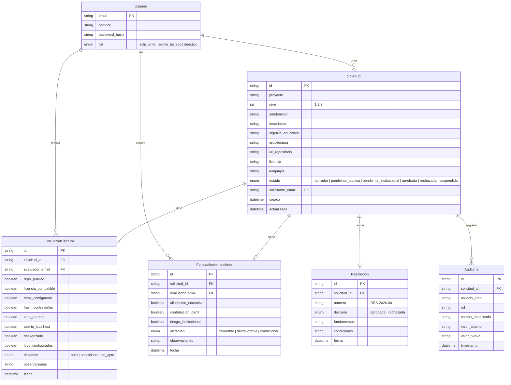

# Modelo de Dominio — Gobernanza Digital

**Agente:** Modelador | **Fecha:** Junio 2026

---

## Entidades principales

---

## Value Objects

| VO | Campos | Reglas |
|:---|:-------|:-------|
| `Email` | valor: str | Debe contener `@` y un dominio |
| `Subdominio` | nombre: str | Solo letras, números y guiones. Sin `ies9018malargue.edu.ar` |
| `NivelServicio` | valor: int | 1, 2 o 3 |
| `EstadoSolicitud` | valor: str | Enum con 6 valores. Transiciones controladas |

---

## Agregados

**Solicitud** es la raíz de agregado. Contiene:
- `Solicitud` (raíz)
- `EvaluacionTecnica` (parte del agregado)
- `EvaluacionInstitucional` (parte del agregado)
- `Resolucion` (parte del agregado)

Regla: todos los cambios a una solicitud y sus evaluaciones pasan por la raíz del agregado. No se modifica una evaluación directamente sin pasar por la solicitud.

---

## Invariantes de dominio

1. Una solicitud en estado `borrador` no puede ser evaluada
2. Una solicitud `aprobada` no puede volver a `pendiente`
3. Solo `admin_tecnico` puede crear `EvaluacionTecnica`
4. Solo `directivo` puede crear `EvaluacionInstitucional`
5. Toda transición de estado genera un registro de auditoría
6. El subdominio solicitado no puede estar en uso por otro servicio activo

---

## 🧠 Analogía del @docente

> El modelo de dominio es como el **registro civil** de una ciudad. Cada entidad es un acta: nacimiento (solicitud), matrimonio (evaluación), defunción (resolución). Las actas tienen fecha, firma y número único. No podés casar a alguien que no nació (invariante 1), ni des-casar a alguien (invariante 2). Todo queda registrado para siempre (auditoría).
