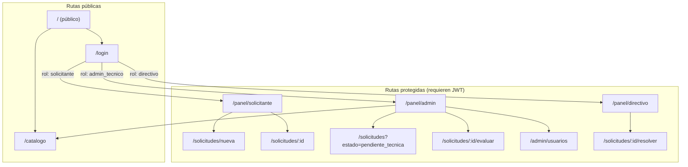

# Flujo de Navegación — Gobernanza Digital

**Reglas de navegación:**
- `/catalogo`: acceso público, sin login
- `/login`: acceso público, redirige según rol
- `/panel/*`: requiere JWT válido, redirige según rol
- Si un usuario con rol `solicitante` intenta acceder a `/panel/admin`, recibe 403
