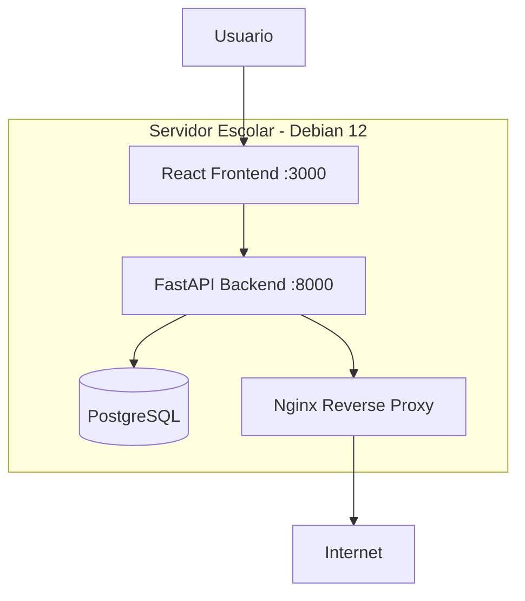

# 🏛️ Gobernanza de Servicios Digitales — IES 9-018

> **Proyecto ejemplar de la Tecnicatura Superior en Desarrollo de Software**
>
> Sistema web para digitalizar el proceso de solicitud, evaluación y aprobación de alojamiento de servicios digitales en el servidor institucional.

---

## 🧠 Analogía del @docente

> *El IES 9-018 es una **ciudad**. El servidor institucional es el **terreno fiscal** donde se construyen edificios (sitios web). Antes de esta gobernanza, cualquiera llegaba, ponía ladrillos y colgaba un cartel con el nombre de la escuela. Algunas construcciones se caían, otras quedaban abandonadas, y no había registro de nada.*
>
> *La Gobernanza de Servicios Digitales es el **código de planeamiento urbano**: define quién puede construir, qué papeles necesita, quién revisa los planos, quién firma el permiso, y cómo se demuele si algo sale mal.*
>
> *Este proyecto construye la **ventanilla única digital** donde los ciudadanos presentan sus planos, los inspectores revisan, el intendente firma, y todo queda registrado.*

---

## ⚠️ Aclaración importante

**Este proyecto es material pedagógico de referencia creado por el docente.** Muestra CÓMO se construye un sistema profesional desde cero, paso a paso, usando agentes IA como herramientas de trabajo. No es "la solución" que los estudiantes deben copiar — es un modelo para estudiar, entender y aplicar en sus propios proyectos.

El sistema real que digitalice la gobernanza será desarrollado por los estudiantes como proyecto integrador. Este repositorio es la **demostración de que se puede hacer, y de cómo se hace bien.**

---

## 🎯 Objetivo del sistema

Digitalizar el proceso completo de gobernanza definido en [IES9018/gobernanza-servicios-digitales](https://github.com/IES9018/gobernanza-servicios-digitales):

1. **Solicitante** completa formulario de alojamiento con justificación arquitectónica
2. **Admin técnico** evalúa seguridad, infraestructura y requisitos técnicos
3. **Directivo** aprueba o rechaza con fundamentos
4. **Sistema** notifica cambios de estado en tiempo real
5. **Catálogo público** muestra servicios activos con transparencia

---

## 🌐 Stack tecnológico

| Capa | Tecnología | ¿Por qué? |
|:-----|:-----------|:----------|
| Frontend | React + Vite | Estándar de la industria, componentes reutilizables, ecosistema maduro |
| Backend | Python + FastAPI | Los estudiantes conocen Python, Swagger automático, async nativo, validación con Pydantic |
| Base de datos | SQLite (dev) / PostgreSQL (prod) | Arquitectura hexagonal: cambiar de motor no requiere tocar el dominio |
| ORM | SQLModel | Unifica modelos Python con SQL, tipado fuerte |
| Auth | JWT + OAuth2 | Stateless, estándar de industria, compatible con API |
| Infraestructura | Docker + Nginx | El servidor escolar ya tiene Docker y Nginx en Debian 12 |
| CI/CD | GitHub Actions | Integración nativa con GitHub, deploy automatizado |
| Testing | pytest | Los estudiantes ya lo usaron en Modelado de Software |
| Calidad | ruff + mypy | Linting y tipado estático para Python |

---

## 📂 Estructura del proyecto

```
A-gobernanza-digital/
├── 00_REFERENCIAS/          ← Requisitos, stakeholders, historias de usuario
├── 01_PLAN_MAESTRO/         ← Visión y principios arquitectónicos
├── 02_CASOS_DE_USO/         ← Casos de uso detallados (Cockburn)
├── 03_ARQUITECTURA/         ← ADRs, diagramas C4, arquitectura hexagonal
│   └── adr/                 ← Architecture Decision Records
├── 04_MODELO_DATOS/         ← Dominio, entidades, esquema SQL
├── 06_INTERFAZ_USUARIO/     ← Wireframes y flujos de navegación
├── 07_IMPLEMENTACION/       ← Stack, setup, CI/CD, deploy
├── 08_CODIGO_FUENTE/        ← Código funcional
│   ├── backend/             ← FastAPI (domain, application, infrastructure, web)
│   └── frontend/            ← React + Vite (components, pages, services, hooks)
├── docker-compose.yml       ← Orquestación de servicios
└── README.md                ← Este archivo
```

---

## 🔗 Materias involucradas

| Materia | Qué aporta al proyecto |
|:--------|:-----------------------|
| **Arquitectura y Diseño de Interfaces** | Hexagonal, C4, ADRs, wireframes, UX/UI |
| **Práctica Profesionalizante III** | Proyecto integrador real, despliegue, documentación |
| **Programación III** | FastAPI, React, JWT, WebSockets |
| **Base de Datos** | Modelado, SQL, migraciones |
| **Laboratorio de Servidores** | Docker, Nginx, Debian, CI/CD |

---

## 🧱 Arquitectura (vista previa)



Arquitectura hexagonal: el dominio no sabe si la base de datos es SQLite o PostgreSQL, si el frontend es React o HTMX, o si el email se envía por SMTP o API.

---

## 🚀 Cómo se construyó (bitácora de agentes)

| Etapa | Agente | Output |
|:------|:-------|:-------|
| 0 | @infrastructure | Estructura, Docker, README |
| 1 | Analista | Requisitos, stakeholders, historias |
| 2 | Arquitecto | ADRs, C4, hexagonal |
| 3 | Modelador | Dominio, entidades, SQL |
| 4 | Especificador | Casos de uso |
| 5 | Diseñador UI | Wireframes, navegación |
| 6 | Tech Lead | Stack, setup, CI/CD |
| 7 | Desarrollador | Código backend + frontend |
| 8 | @docente + @security + @committer | Ética, seguridad, cierre |

---

## 📜 Licencia

MIT — Este proyecto es material pedagógico abierto. Usalo, estudialo, modificalo.

---

> *"No construimos código rápido. Construimos aprendizaje profundo con código de calidad."*
