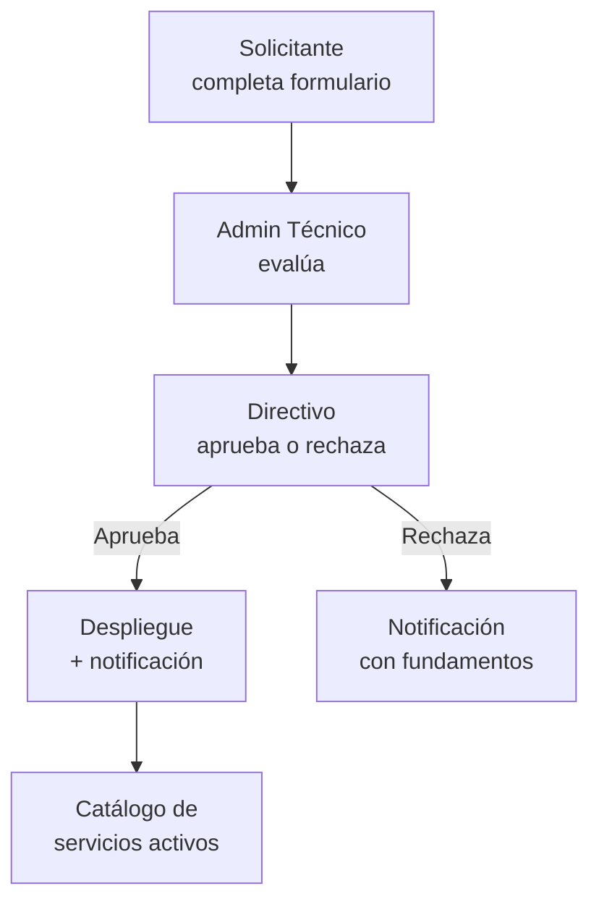

# Proyecto A: Sistema de Gobernanza de Servicios Digitales

## Contexto

El IES 9-018 tiene un servidor institucional donde estudiantes y docentes pueden alojar proyectos digitales. Para ordenar este proceso, se creó la [Política de Gobernanza de Servicios Digitales](https://github.com/IES9018/gobernanza-servicios-digitales), un marco documental con 12 documentos que definen cómo solicitar, evaluar, aprobar, alojar y suspender servicios.

Hoy, todo ese proceso se maneja **en papel o por email**. El objetivo de este proyecto es digitalizar el proceso completo.

---

## Objetivo del Sistema

Crear una aplicación web que permita:

1. **Estudiantes/docentes** completen una solicitud de alojamiento online
2. **Admin técnico** evalúe la viabilidad técnica
3. **Directivos** aprueben o rechacen la solicitud
4. **Seguimiento** del estado de cada solicitud en tiempo real
5. **Catálogo público** de servicios activos en el servidor

---

## Flujo de Trabajo

---

## Funcionalidades Core

| # | Funcionalidad | Prioridad |
|:-:|:--------------|:---------:|
| 1 | Formulario de solicitud con campos dinámicos | Alta |
| 2 | Panel de evaluación técnica con checklist | Alta |
| 3 | Panel de aprobación directiva | Alta |
| 4 | Notificaciones por email al cambiar estado | Alta |
| 5 | Catálogo público de servicios activos | Media |
| 6 | Historial de cambios por solicitud | Media |
| 7 | Roles: Solicitante, Admin Técnico, Directivo | Alta |

---

## Stack Recomendado

| Capa | Tecnología |
|:-----|:-----------|
| Frontend | React + Vite o Next.js |
| Backend | Python + FastAPI |
| Base de Datos | PostgreSQL |
| Infraestructura | Docker |
| CI/CD | GitHub Actions |

---

## Relación con la Materia

| Contenido de ADI | Cómo se aplica en este proyecto |
|:-----------------|:--------------------------------|
| Patrones arquitectónicos | Arquitectura hexagonal para separar lógica de negocio de la UI y la DB |
| Diseño de interfaces | Wireframes de formulario de solicitud, dashboard de administración |
| ADRs | Cada decisión tecnológica documentada (por qué FastAPI, por qué PostgreSQL) |
| C4 Model | Diagramas de contexto, contenedores y componentes |
| Estándares globales | Conventional Commits, SemVer, CI/CD |
| Trabajo colaborativo | PRs, issues, ramas por agente |

---

## Documentación de Referencia

- [Política de Gobernanza](https://github.com/IES9018/gobernanza-servicios-digitales)
- Documento 01: [Solicitud de Alojamiento](https://github.com/IES9018/gobernanza-servicios-digitales/blob/main/docs/01_SOLICITUD_ALOJAMIENTO.md)
- Documento 02: [Evaluación Técnica](https://github.com/IES9018/gobernanza-servicios-digitales/blob/main/docs/02_EVALUACION_TECNICA.md)
- Documento 08: [Resolución Directiva](https://github.com/IES9018/gobernanza-servicios-digitales/blob/main/docs/08_RESOLUCION_DIRECTIVA.md)
