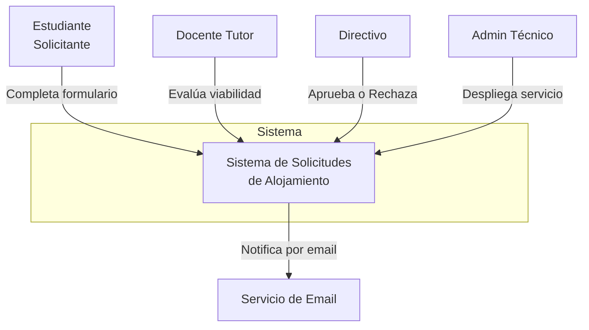

# Ejercicio 02: Diagrama C4 de Contexto

## Objetivo

Aprender a usar el modelo C4 para representar la arquitectura de tu sistema en el nivel más alto: el diagrama de Contexto.

## Prompt (copiá y pegá en tu terminal de IA)

```text
Actuá como un Arquitecto de Software. Voy a darte la descripción
de un sistema, y quiero que generes un diagrama C4 de **Contexto**
(Nivel 1) usando Mermaid.

Mi proyecto se llama: [NOMBRE DE TU PROYECTO]

Descripción breve: [DESCRIPCIÓN EN 2-3 LÍNEAS]

Usuarios: [LISTA DE USUARIOS]

Funcionalidades principales: [LISTA DE FUNCIONALIDADES]

Sistemas externos con los que se conecta: [EJ: email, APIs, etc.]

Generame:
1. Un diagrama Mermaid del nivel Contexto
2. Una explicación de cada elemento del diagrama
3. Una descripción de qué hace cada usuario en el sistema
```

## Ejemplo de output esperado



## Lo que aprendés haciendo esto

- A **pensar en sistemas completos**, no solo en código
- A identificar **actores y sistemas externos**
- A usar **Mermaid** para diagramas que se renderizan en GitHub
- A comunicar arquitectura visualmente

## Entrega

1. Carpeta `03_ARQUITECTURA/diagramas/`
2. Archivo `03_ARQUITECTURA/diagramas/c4-contexto.md` con el diagrama Mermaid
3. Commit: `git commit -m "feat: diagrama C4 de contexto del sistema"`
4. Rama: `feat/ej-02-c4-contexto`

## Criterios de aprobación

- [ ] El diagrama se renderiza correctamente en GitHub (probá abriendo el archivo)
- [ ] Aparecen todos los usuarios que identificaste en el ejercicio 01
- [ ] Aparecen los sistemas externos si los hay
- [ ] Las flechas tienen etiquetas que describen la interacción
- [ ] Tenés un texto explicativo abajo del diagrama
