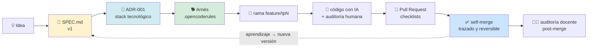
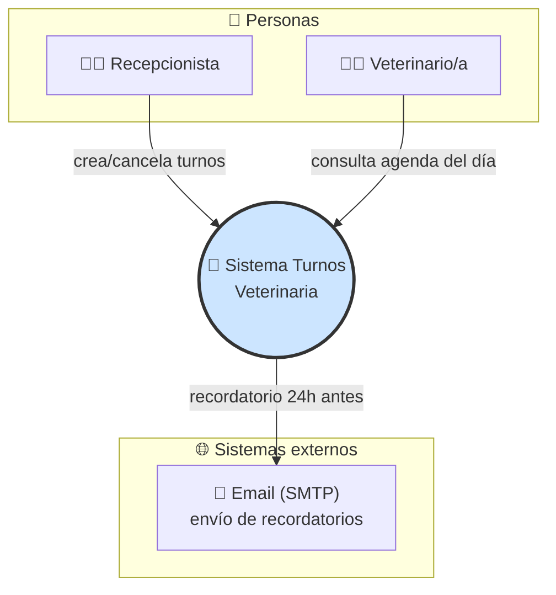
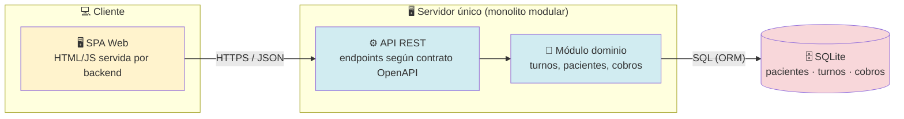

# 🎓 Teoría para Clase: SDD, SPEC y Modelo C4

> Material del docente · Arquitectura y Diseño de Interfaces · PP3 2026 · Prof. Paulo Alvarez
> Renderizable en VS Code (`Ctrl+Shift+V`) o directamente en GitHub.

## 📖 Diccionario rápido (inglés → castellano)

| Término | Se lee | Qué significa |
|---|---|---|
| **SPEC / SPEC.md** | espec | La especificación: documento que define QUÉ se construye, ANTES de programar |
| **SDD** (Spec-Driven Development) | ese-di-di | Desarrollo guiado por la especificación: primero la SPEC, después el código |
| **Vibe Coding** | vaib kouding | Programar por vibra: pedirle todo a la IA sin plan ni control |
| **Non-Goals** | non-goals | Metas excluidas: lo que NO vas a construir en esta etapa (y por qué) |
| **Scope** | skoup | Alcance: cuánto incluye tu sistema |
| **ADR** (Architecture Decision Record) | a-de-erre | Registro escrito de una decisión de arquitectura |
| **Stack tecnológico** | stak | Conjunto de tecnologías elegidas: lenguaje, framework, base de datos |
| **Arnés** | (castellano) | Archivo de reglas que limita a tu IA (.opencoderules u equivalente según herramienta) |
| **Rama / branch** | bransh | Línea de trabajo paralela: cada funcionalidad va en su rama feature/tema |
| **PR** (Pull Request) | pi-u-arr | Pedido para incorporar tus cambios a main, con plantilla y checklists |
| **Self-merge** | self-merch | Fusión propia: vos mismo integrás tu PR cuando los checklists están completos |
| **Rollback** | roul-bak | Volver atrás: deshacer un cambio y restaurar el estado anterior |
| **Changelog** (registro de cambios) | chein-loug | Registro de cambios por versión: v1 a v2, qué cambió y por qué |
| **Supersede** | siper-sid | Dejar sin efecto: un ADR nuevo reemplaza a uno viejo (el viejo nunca se borra) |
| **Diffable** | dif-ei-bol | Comparable: se ve la diferencia línea a línea entre versiones |
| **C4** | si-cuatro | Contexto, Contenedores, Componentes, Código: los cuatro niveles de zoom |
| **SPA** (Single Page Application) | esa-pa-ei | Aplicación de una sola página: vive en el navegador y habla con el servidor por JSON |
| **API REST** | a-pi rest | Las puertas del sistema: URLs que otras aplicaciones consultan |
| **Endpoint** | end-point | Cada puerta concreta: una URL que responde algo específico |
| **OpenAPI** | oupen-api | Formato estándar para escribir los endpoints por contrato, antes de codear |
| **JSON** | yeyson | Formato de texto simple para intercambiar datos entre programas |
| **SQL / ORM** | secuel / orem | SQL: lenguaje de las bases de datos. ORM: traductor entre objetos del código y las tablas || **RF** (Requerimiento Funcional) | erre-effe | Una función concreta que el sistema debe hacer; se numera (RF-01, RF-02...) para probarla y rastrearla || **Kanban** | kan-ban | Tablero visual con columnas Por hacer → En progreso → Hecho; las tareas son tarjetas que se mueven || **Commit** | comit | Guardar una foto del proyecto con mensaje: la unidad mínima del historial || **Issue** | ishu | Tarjeta de discusión en GitHub: duda, bug o tarea || **MVP** (Minimum Viable Product) | eme-uve-pe | Producto mínimo viable: lo más chico que ya sirve y se puede mostrar |


---

## 0️⃣ El problema: Vibe Coding

**Vibe coding** (programar por vibra, sin plan). = sentarse frente a la IA, describir "vibes" ("haceme una app de turnos linda") y aceptar lo que genera sin especificación ni control.

| Síntoma | Consecuencia |
|---|---|
| Prompt mágico gigante | Código que nadie entiende ni puede defender |
| Sin SPEC | La IA inventa requisitos que nunca pediste |
| Sin decisiones documentadas | Cada refactor rompe lo anterior |
| Merge directo a main | Historial ilegible, rollback (volver atrás) imposible |

> **Frase clave para pizarra:** *"La IA no sabe qué construir. Si vos tampoco lo escribiste, ella decide por vos."*

---

## 1️⃣ Spec-Driven Development (SDD - Desarrollo Guiado por la Especificación)

**Definición:** metodología donde la **especificación es la fuente de verdad** y el código su implementación. El humano dirige (define, decide, audita); la IA acelera.

### Cambio de rol del estudiante

```
❌ Programador que teclea    →    ✅ Director técnico que especifica y audita
   "haceme X"                      "esto dice mi SPEC, esto decidí en el ADR,
                                    esto prohibe mi arnés: verificá tu salida"
```

### El ciclo SDD del curso (memorizar este orden)



> **El loop punteado es el corazón:** cada sprint termina mejorando la SPEC (v1→v2→vFinal). La especificación es un documento **vivo**, no un PDF inicial.

---

## 2️⃣ Anatomía de la SPEC.md

| Sección | Qué contiene | Error típico sin ella |
|---|---|---|
| **1. Contexto y propósito** | Problema real, usuarios, alcance general | Sistema sin norte que "hace de todo" |
| **2. Requerimientos Funcionales (RF)** | `RF-01`, `RF-02`… numerados y verificables | Features difusos imposibles de testear |
| **3. Non-Goals** ⭐ | Lo que **NO** vas a construir (y por qué) | Scope (alcance) infinito: la IA agrega features fantasma |
| **4. Contratos de datos** | Entidades principales, campos, relaciones | Modelos inconsistentes entre módulos |
| **Changelog** (registro de cambios) | `v1 → v2`: fecha, qué cambió, motivo | Nadie sabe qué versión está leyendo |

⭐ **Non-Goals es la sección más importante.** Ejemplo real:

```markdown
## 3. Non-Goals (esta etapa)
- NO hay pagos online (solo registro de cobros manuales)
- NO hay app móvil nativa (responsive web alcanza)
- NO multi-sede: un solo local
```

> **Frase clave:** *"Un Non-Goal bien justificado vale igual que un feature. Definir qué no hacés es arquitectura."*

---

## 3️⃣ ADR en 60 segundos

`docs/adr/ADR-001-stack-tecnologico.md`

| Campo | Pregunta que responde |
|---|---|
| Contexto | ¿Qué problema técnico tengo HOY? |
| Decisión | ¿Qué elegí? |
| Alternativas descartadas (≥2) | ¿Qué NO elegí y con qué criterios objetivos? |
| Consecuencias | ¿Qué me facilita? ¿Qué me encarece? |

Los ADR se **encadenan**: ADR-002 (estilo arquitectónico), ADR-003 (persistencia)… nunca se borran; uno nuevo *supersede* (deja sin efecto) al anterior.

---

## 4️⃣ Modelo C4 (Contexto, Contenedores, Componentes, Código) — "Google Maps de tu sistema"

De Simon Brown. Cuatro niveles de zoom; en este cuatrimestre usamos los primeros dos.

### Nivel 1 — Contexto 🌍

Tu sistema es **una caja negra**: quién lo usa y con qué otros sistemas habla. Sin detalles internos.



**Pregunta guía del nivel 1:** *"¿Quién usa mi sistema y qué otros sistemas toca?"*

### Nivel 2 — Contenedores 🔬

Abrimos la caja: aplicaciones, bases de datos, servicios internos y **los protocolos entre ellos**.



**Pregunta guía del nivel 2:** *"¿Cuáles son las piezas ejecutables y cómo se comunican?"*

*(Los niveles 3-Componentes y 4-Código existen, pero quedan fuera del alcance del cuatrimestre: Non-Goal declarado 😉)*

---

## 5️⃣ Las reglas de oro del diagrama

1. **Trazabilidad total:** cada caja debe existir en tu SPEC o en algún ADR. **Si no aparece allí, no entra al diagrama** (nada de cajas-fantasma "para después").
2. **El diagrama documenta decisiones tomadas**, no deseos. Cambió la decisión → nuevo ADR → se actualiza el diagrama.
3. **Mermaid, no capturas:** el diagrama es *texto* → versionable, diffable (comparable línea a línea), auditable en el PR. Igual que el código.

---

## 6️⃣ Cierre de clase: las tres preguntas del examen

1. *"Mostrame tu SPEC"* → ¿existe, tiene Non-Goals, tiene changelog?
2. *"¿Por qué este stack?"* → ¿hay ADR con alternativas descartadas objetivas?
3. *"Dibujá tu sistema"* → ¿nivel contexto y contenedores trazables a la SPEC?

Quien responde las tres **dirige a su IA**. Quien no, trabaja por vibes.

---

📚 **Profundizar:** [Teoría Unidad 1](https://github.com/IES9018/ADI-teoria-y-recursos/tree/main/unidad-1-procesos-y-metodologias) · [Teoría Unidad 2](https://github.com/IES9018/ADI-teoria-y-recursos/tree/main/unidad-2-arquitectura-de-software) · Consigna [TP1](https://github.com/IES9018/proyecto-adi-2026/blob/main/trabajos-practicos/tp1-sdd-y-arneses/README.md)
